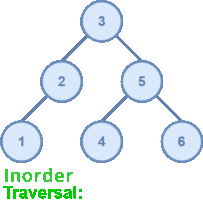

# Binary Search Tree
- [Introduction](#introduction)
- [Key concepts](#key-concepts)
- [How to compile](#how-to-compile)
- [Usage file](#usage-file)

## Introduction
A Binary Search Tree (BST) is a node-based binary tree data structure which has the following properties:
* The left subtree of a node contains only nodes with keys lesser than the node’s key.
* The right subtree of a node contains only nodes with keys greater than the node’s key.
* The left and right subtree each must also be a binary search tree.

BST's allow binary search for fast lookup, addition, and removal of data items. Since the nodes in a BST are laid out in such a way that each comparison skips about half of the remaining tree, the lookup performance is proportional to that of binary logarithm.

The complexity analysis of BST shows that, on average, the insert, delete and search takes $O(log\;n)$ for $n$ nodes and at the worst case, they degrade to that of a singly linked list: $O(n)$. The self-balancing variants of BST such as AVL trees and red-black trees can be used to bound the worst lookup complexity to that of binary logarithm.

## Key concepts

### Operations available
This project allows to perform the following operations:
* Add a node.
* Remove a node.
* Obtain the tree's height.
* Traverse the tree.
* Check if the tree contains a certain value.
* Display the tree on a graphic form on the terminal.

### Tree height
The height of a node in a binary tree is the largest number of edges in a path from a leaf node to a target node. If the target node doesn’t have any other nodes connected to it, the height of that node would be 0. Therefore, the height of a binary tree is the height of the root node in the whole binary tree. In other words, the height of a binary tree is equal to the largest number of edges from the root to the most distant leaf node.

On the image above, we can see that the path with most edges is through 10 → 13 → 12 → 11, making the height of the tree 3.

### Tree traversal
Tree traversal is the process of visitting each of the tree nodes exactly once, these traversals are classified by the order in which the nodes are visited. This project only contains the Depth First Traversals.

#### **Inorder**

#### **Preorder**

#### **Postorder**