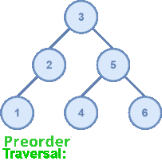
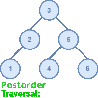

# Binary Search Tree
- [Introduction](#introduction)
- [Key concepts](#key-concepts)
- [How to compile](#how-to-compile)
- [Usage file](#usage-file)

## Introduction
A Binary Search Tree (BST) is a node-based binary tree data structure which has the following properties:
* The left subtree of a node contains only nodes with keys lesser than the node’s key.
* The right subtree of a node contains only nodes with keys greater than the node’s key.
* The left and right subtree each must also be a binary search tree.

BST's allow binary search for fast lookup, addition, and removal of data items. Since the nodes in a BST are laid out in such a way that each comparison skips about half of the remaining tree, the lookup performance is proportional to that of binary logarithm.

The complexity analysis of BST shows that, on average, the insert, delete and search takes $O(log\;n)$ for $n$ nodes and at the worst case, they degrade to that of a singly linked list: $O(n)$. The self-balancing variants of BST such as AVL trees and red-black trees can be used to bound the worst lookup complexity to that of binary logarithm.

## Key concepts

### Operations available
This project allows to perform the following operations:
* Add a node.
* Remove a node.
* Obtain the tree's height.
* Traverse the tree.
* Check if the tree contains a certain value.
* Display the tree on a graphic form on the terminal.

### Tree height
The height of a node in a binary tree is the largest number of edges in a path from a leaf node to a target node. If the target node doesn’t have any other nodes connected to it, the height of that node would be 0. Therefore, the height of a binary tree is the height of the root node in the whole binary tree. In other words, the height of a binary tree is equal to the largest number of edges from the root to the most distant leaf node.
<div align='center'>

</div>
On the image above, we can see that the path with most edges is through 10 → 13 → 12 → 11, making the height of the tree 3.

### Tree traversal
Tree traversal is the process of visitting each of the tree nodes exactly once, these traversals are classified by the order in which the nodes are visited. This project only goes through the (Depth First Search) Traversals.

#### **Inorder**
Inorder Traversal is the one the most used variant of DFS(Depth First Search) Traversal of the tree.

As DFS suggests, we will first focus on the depth of the chosen Node and then go to the breadth at that level. Therefore, we will start from the root node of the tree and go deeper-and-deeper into the left subtree with recursive manner.

The basic idea on inorder traversal is following the order **Left, Root, Right**.

#### **Preorder**
Preorder Traversal is another variant of DFS. Where atomic operations in a recursive function, are as same as Inorder traversal but with a different order.

Here, we visit the current node first and then goes to the left sub-tree. After covering every node of the left sub-tree, we will move towards the right sub-tree and visit in a similar fashion.

The basic idea on inorder traversal is following the order **Root, Left, Right**.

#### **Postorder**
Similar goes with Postorder Traversal. Where we visit the left subtree and the right subtree before visiting the current node in recursion.

The basic idea on inorder traversal is following the order **Left, Right, Root**.

Below, you can see how the differen traversals look on the same BST. The arrengement is: inorder, preorder and postorder.
<div align='center'>



</div>

## How to compile
Compiling the project is really simple, just run the _make_ command on the project's BST directory.
```bash
cd binary_search_tree
make
```
By doing so, the executable _demo_binary_search_tree_ will be created on the same directory. This file will execute the instructions written on the [usage file](#usage-file).

## Usage file
The projects contains a file that serves as a manual of how to use the C library, it is a simple test that initially creates a 15-node tree like this one:
<div align='center'>

</div>

Then, removes 3 nodes to obtain the resulting tree:
<div align='center'>

</div>

Also, during those 2 operations (add nodes/remove nodes), tree statistics are calculated (height, traversals, etc).

All the functions available on the header file are tested.